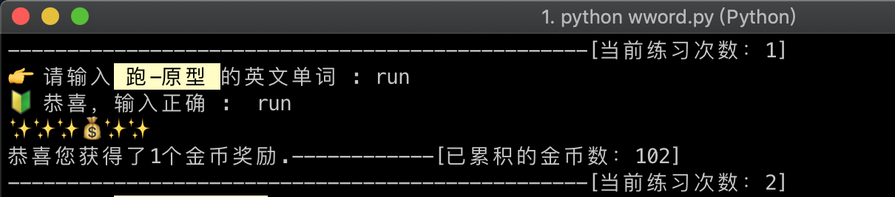
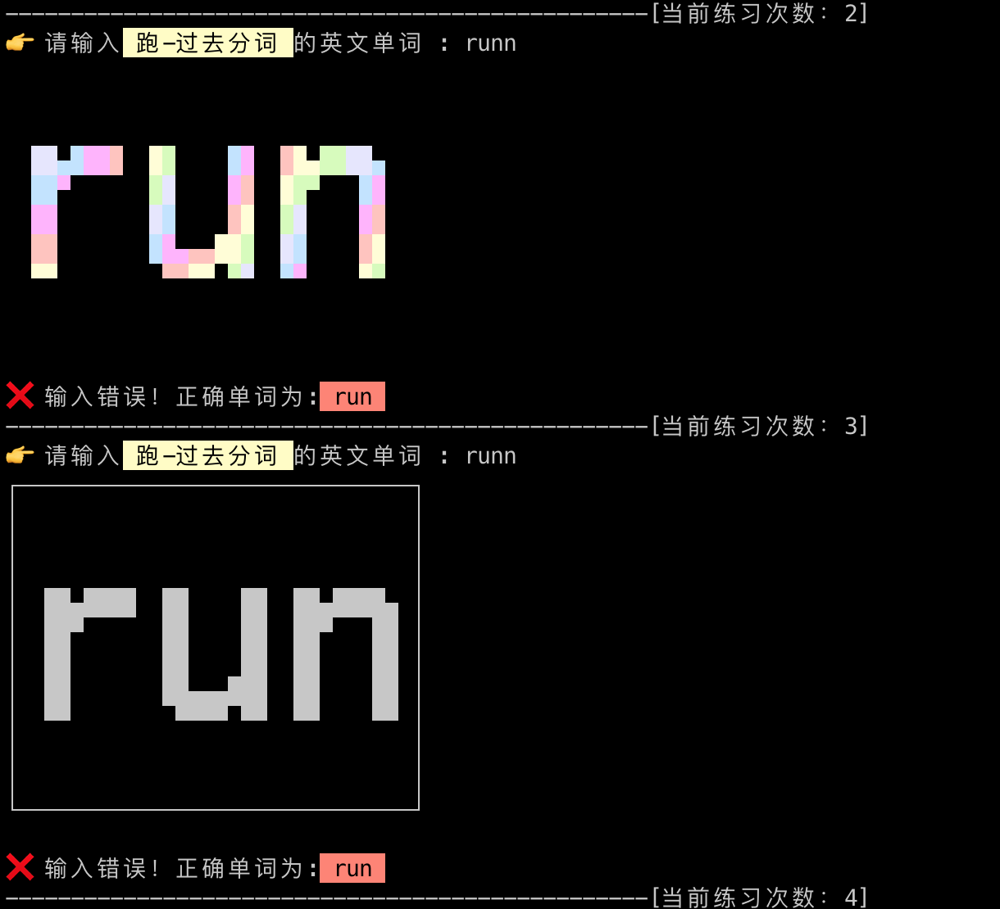

# wword

wword是一款让你背单词就停不下来的软件，使用流程遵循"斯金纳箱"概率型奖励原理来设计。

利用系统命令行终端的快速输入环境来默写单词，随机读取，输入正确后，该单词会从当前文本内删除，避免重复背。

主要用来记忆单词，但不仅仅记忆单词，可以记忆一切你想要记住的东西。

# 需要环境

Python version 2.7.x

安装toilet库
```shell
# linux 安装方法
sudo apt install toilet

# mac os 安装方法
brew install toilet
```


# 配置说明

使用前先修改正确wword.py里面的路径
```python
# 注意：要使用之前，先将如下路径修改成你主机内的正确路径
regulartxt = '/Users/Mysticbinary/Document/code/wword/db/underwaylibrary/regular.txt'
kindslibrarypath = '/Users/Mysticbinary/Document/code/wword/db/kindslibrary/'
underwaylibrarypath = '/Users/Mysticbinary/Document/code/wword/db/underwaylibrary/'
usermoneypath = '/Users/Mysticbinary/Document/code/wword/src/initfiles/usermoney.txt'
fontstylepath = '/Users/Mysticbinary/Document/code/wword/src/initfiles/fontstyle.txt'
```

.kindslibrary/文件夹里面就是放你想要背的单词库，如果有编程能力，可以自己接接口。

文本设置格式为: 左边是中文意思，右边是英文单词，中间用@符号分割开；
```text
猫@cat
老虎@tiger
```


# 使用流程
```shell
python wword.py
```


# v2.0.0 运行效果图

** 当输入正确的单词时：**

随机获得金币奖励


** 当输入错误的单词时：**

用随机字符图来显示


# 版本更新说明

v2.0.0 ：

进行了重大架构改变，更改成概率分布来抽取要背的单词；
    
​新加多词库功能，用户可以添加多个词库，程序自动将背完的词放入对应的file；

词库更新单词识别，往词库新添加功能也能自动识别；

随机用字符图来展示错误单词；

随机获得金币奖励；


新加了一个动词词库 verborigin.txt；

​新加了一个词组词库 wordgrouporigin.txt；

v1.0.2：

调整READM.md 图片展示效果。

v1.0.1：

整体框架完成，已经可以正常使用。