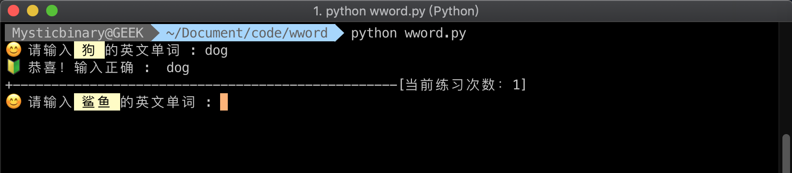
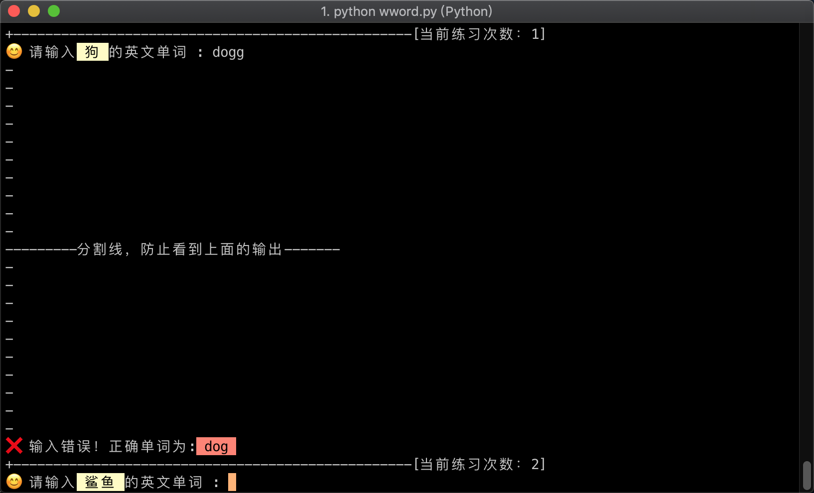

# 软件说明
利用系统命令行终端环境背单词，随机读取，输入正确后，该单词会从当前文本内删除，避免重复背。
@Author  : Mysticbinary

# 配置说明
使用前先修改正确wword.py里面的路径
```python
# 注意：要使用之前，先将这两个路径修改成你主机内的正确路径
newwordsname = '/Users/Mysticbinary/Document/code/wword/db/newwords.txt'
oldwordsname = '/Users/Mysticbinary/Document/code/wword/db/oldwords.txt'
```

newwords.txt文本就是放你想要背的单词，如果有编程能力，可以自己接接口。
设置格式为: 左边是中文意思，右边是英文单词，中间用英文逗号分割；
```text
猫,cat
老虎,tiger
```

oldwords.txt文本不需要做任何设置，当你输入正确的单词，会自动转移到这里。


# 需要环境
Python 2.X


# 运行效果图

当输入正确的单词时：


当输入错误的单词时：
